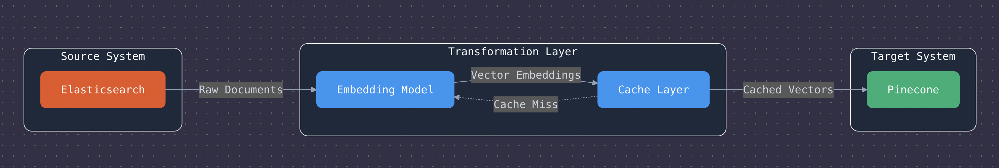

# ES to Pinecone

[](https://badge.fury.io/py/es-to-pinecone-transfer)
[](https://opensource.org/licenses/MIT)

A Python package for efficiently transferring documents from Elasticsearch to Pinecone with vector embeddings and threading support.

<p align="center">
  
</p>

## Overview

ES to Pinecone bridges the gap between traditional search engines (Elasticsearch) and vector databases (Pinecone), enabling semantic search capabilities. The pipeline extracts documents from Elasticsearch, generates vector embeddings using providers like OpenAI or HuggingFace, and uploads them to Pinecone.

## Features

- **Simple Configuration**: Minimal setup required through environment variables or direct configuration
- **Multiple Embedding Providers**: Support for OpenAI, HuggingFace, and custom embedding generators
- **Multi-threaded Processing**: Parallel processing for significantly faster operations
- **Flexible Field Selection**: Choose which document fields to embed and include as metadata
- **Progress Tracking**: Built-in progress visualization with tqdm and custom callbacks
- **Robust Error Handling**: Comprehensive exception handling and detailed logging
- **Dry Run Mode**: Test configuration without writing to Pinecone

## Installation

```bash
pip install es-to-pinecone
```

## Quick Start

1. Create a `.env` file with your configuration:

```
# Elasticsearch Configuration
ES_HOST=http://localhost:9200
ES_USERNAME=elastic
ES_PASSWORD=changeme
ES_INDEX=your_index

# Embedding Configuration
EMBEDDING_TYPE=openai
OPENAI_API_KEY=your_openai_key
OPENAI_MODEL=text-embedding-ada-002

# Pinecone Configuration
PINECONE_API_KEY=your_pinecone_key
PINECONE_ENVIRONMENT=us-west1-gcp
PINECONE_INDEX_NAME=your_pinecone_index

# Pipeline Configuration
BATCH_SIZE=100
MAX_THREADS=5
FIELDS_TO_EMBED=title,content
METADATA_FIELDS=author,date,url
DEFAULT_NAMESPACE=default
```

2. Use the pipeline in your code:

```python
from es_to_pinecone_transfer.pipeline import ElasticsearchToPineconePipeline

# Initialize the pipeline
pipeline = ElasticsearchToPineconePipeline()

# Run the pipeline
stats = pipeline.run()

print(f"Processed: {stats['processed']} documents")
print(f"Upserted: {stats['upserted']} documents")
print(f"Failed: {stats['failed']} documents")
```

3. Or use the command-line interface:

```bash
es-to-pinecone
```

## Documentation

Comprehensive documentation is available in the [docs directory](docs/):

- [Configuration Options](docs/configuration.md): All available configuration settings
- [Usage Examples](docs/examples.md): Detailed usage examples
- [API Reference](docs/api.md): Complete API documentation
- [Troubleshooting](docs/troubleshooting.md): Solutions for common issues

## Example Scripts

Ready-to-use example scripts are available in the [examples directory](examples/):

- [basic_transfer.py](examples/basic_transfer.py): Simple document transfer
- [advanced_transfer.py](examples/advanced_transfer.py): Advanced usage with progress tracking and filtering
- [semantic_search.py](examples/semantic_search.py): Perform semantic search with the transferred vectors

## Advanced Usage

### Filtering Documents with a Query

```python
# Define a query to filter documents
query = {
    "bool": {
        "must": [
            {"match": {"status": "published"}},
            {"range": {"published_date": {"gte": "2023-01-01"}}}
        ]
    }
}

# Run the pipeline with the query
stats = pipeline.run(query=query)
```

### Custom Field Mapping

```python
# Set field mapping
pipeline.set_field_mapping({
    'title': 'document_title',
    'content': 'document_content',
    'author': 'author_name'
})
```

### Progress Tracking

```python
# Define a progress callback
def progress_callback(current_batch, total_batches):
    percent = (current_batch / total_batches) * 100
    print(f"Progress: {current_batch}/{total_batches} ({percent:.2f}%)")

# Set the progress callback
pipeline.set_progress_callback(progress_callback)
```

## Error Handling

```python
from es_to_pinecone_transfer.exceptions import (
    ElasticsearchConnectionError,
    PineconeConnectionError,
    EmbeddingError,
    ConfigurationError
)

try:
    pipeline = ElasticsearchToPineconePipeline()
    stats = pipeline.run()
except ConfigurationError as e:
    print(f"Configuration error: {e}")
except ElasticsearchConnectionError as e:
    print(f"Elasticsearch connection failed: {e}")
except PineconeConnectionError as e:
    print(f"Pinecone connection failed: {e}")
except EmbeddingError as e:
    print(f"Embedding generation failed: {e}")
except Exception as e:
    print(f"Unexpected error: {e}")
```

## Architecture

The pipeline consists of these main components:

1. **ElasticsearchClient**: Extracts documents from Elasticsearch
2. **Embedding Generators**: Convert text to vector embeddings
3. **PineconeClient**: Uploads vectors to Pinecone
4. **Pipeline Coordinator**: Manages the transfer process with threading

## Contributing

Contributions are welcome! Please feel free to submit a Pull Request.

1. Fork the repository
2. Create your feature branch (`git checkout -b feature/amazing-feature`)
3. Commit your changes (`git commit -m 'Add some amazing feature'`)
4. Push to the branch (`git push origin feature/amazing-feature`)
5. Open a Pull Request

## License

This project is licensed under the MIT License - see the [LICENSE](LICENSE) file for details.
